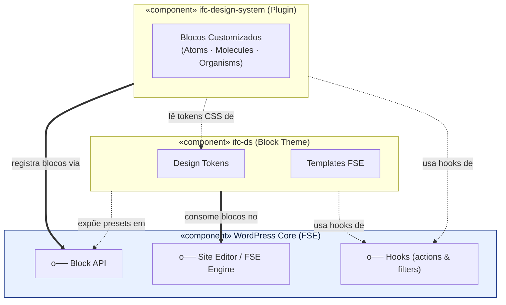
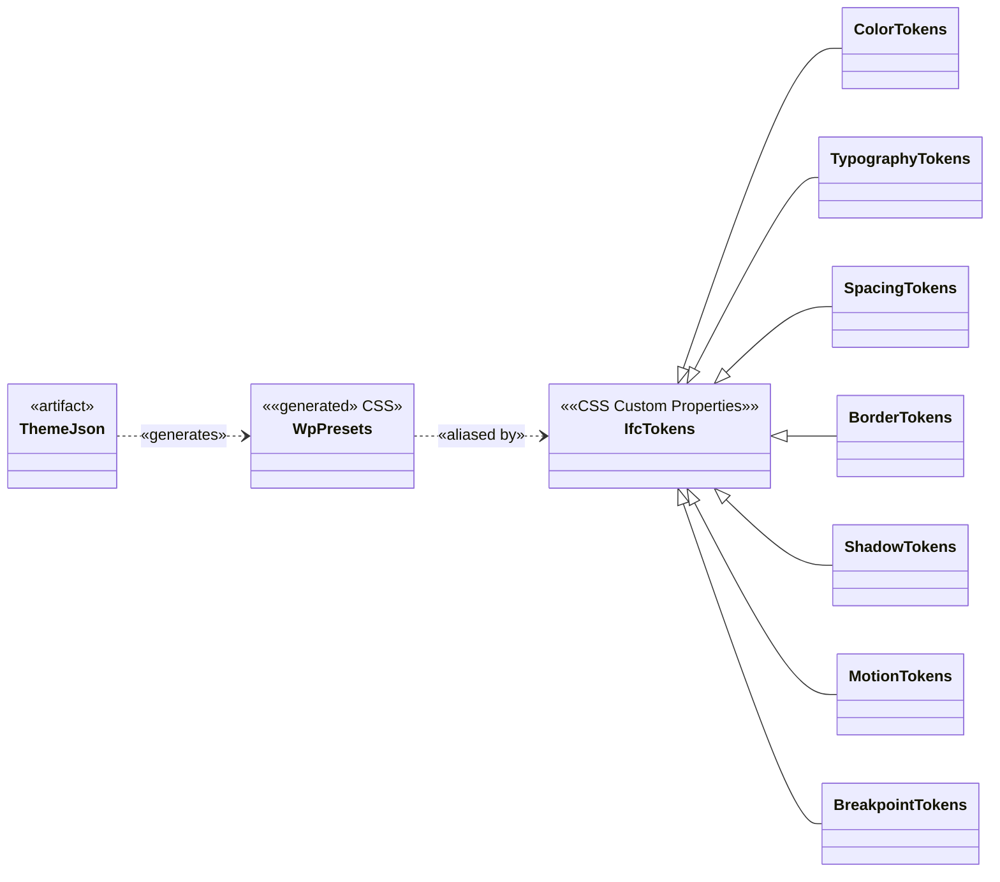
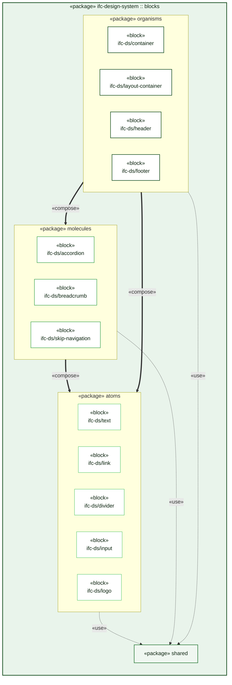
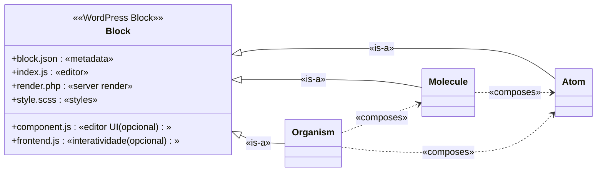
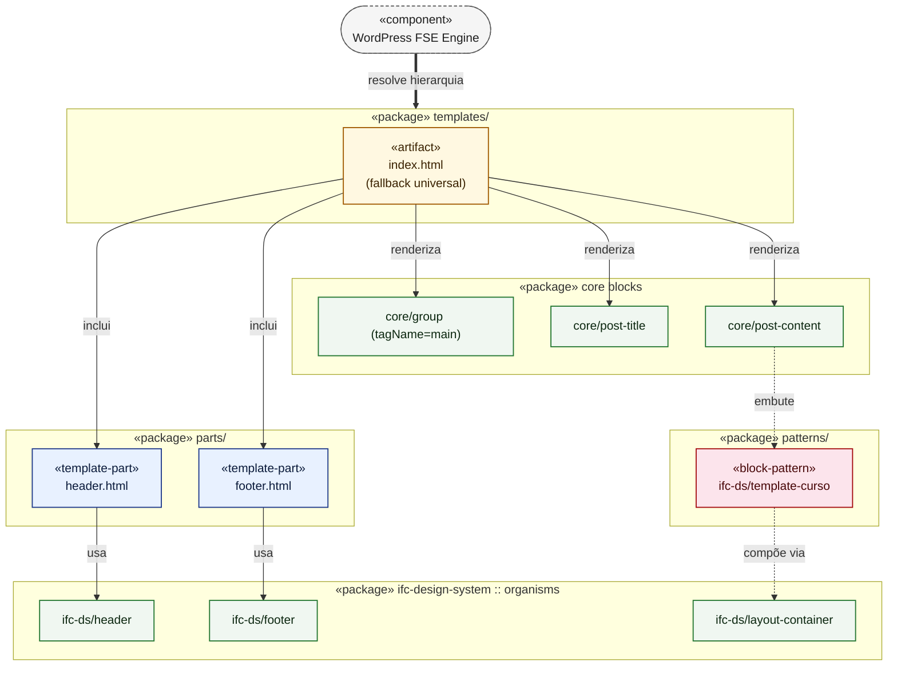
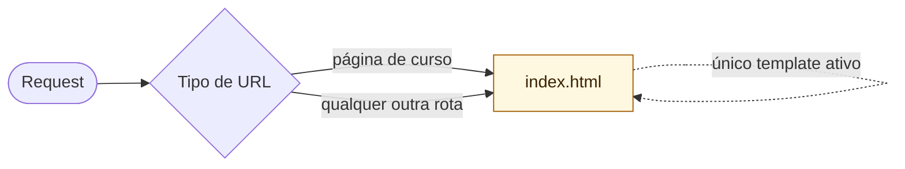

# Arquitetura — IFC Design System

Documento de referência arquitetural do projeto. Os diagramas seguem
notação **UML** (Component Diagram, Class Diagram e Package Diagram) e
estão escritos em **Mermaid** para renderização nativa no Cursor, VS Code
e GitHub.

Convenção UML adotada nos diagramas:

- `«component»` — componente implantável (plugin, tema, motor do WP).
- `«package»` — agrupador lógico (camada, tier do Atomic Design).
- `«artifact»` — arquivo físico (`block.json`, `theme.json`, `*.html`).
- `o——` — interface fornecida (lollipop).
- `——(`  — interface requerida (socket).
- `..>` — dependência (`<<use>>`, `<<read>>`, `<<render>>`).
- `-->` — associação direcionada.
- `<|--` — herança / refinamento.

---

## 1. Visão Geral — Integração Plugin × Tema × WordPress

> **UML Component Diagram** em alto nível. Mostra como o **plugin
> `ifc-design-system`** (fornecedor de blocos), o **tema `ifc-ds`**
> (consumidor / camada de apresentação FSE) e o **WordPress Core** se
> integram. Sem detalhes técnicos internos.

**Leitura rápida**

- O **plugin** é o único responsável por declarar blocos (independente do
  tema ativo).
- O **tema** fornece os _design tokens_ (cores, tipografia, espaçamento)
  e a hierarquia de templates do FSE.
- A comunicação entre os três sempre passa pelas **APIs públicas do WP**
  (Block API, FSE, hooks) — não há acoplamento direto entre plugin e
  tema.

---

## 2. Estrutura dos Tokens

> **UML Class Diagram**. Modela a cadeia de tradução dos design tokens:
> declaração no `theme.json` → presets do WP → variáveis CSS `--ifc-*` →
> consumo nos blocos.

**Leitura rápida**

- A **fonte da verdade** é o `theme.json` (mantido pelo tema).
- O WP gera automaticamente os presets `--wp--preset--*`.
- Os tokens semânticos `--ifc-*` são um **alias** em cima desses
  presets — é essa a API que os blocos consomem, garantindo
  independência da nomenclatura interna do WP.

---

## 3. Estrutura dos Componentes (Atomic Design)

> **UML Package + Class Diagram**. Cada pacote representa um _tier_ do
> Atomic Design. As setas mostram a relação de composição entre tiers
> (organisms compõem molecules e atoms; molecules compõem atoms).

**Estrutura física de cada bloco** (mostrada como classe UML para
deixar explícita a anatomia comum a todos os tiers):

**Leitura rápida**

- Atoms são primitivos sem dependência de outros blocos.
- Molecules combinam atoms para formar unidades funcionais simples.
- Organisms montam seções completas de página, podendo compor tanto
  molecules quanto atoms.
- O pacote `shared` concentra utilidades comuns usadas
  transversalmente por todos os tiers.

---

## 4. Implementação dos Templates (FSE)

> **UML Component Diagram**. Modela a hierarquia FSE simplificada do
> tema `ifc-ds`: um único template `index.html` serve de fallback
> universal e consome _template parts_ e blocos do plugin para compor
> a página final entregue ao visitante.

**Hierarquia de resolução (FSE)**

**Leitura rápida**

- O tema mantém **um único template** (`index.html`) — o WP exige esse
  arquivo em todo block theme e o utiliza como fallback para qualquer
  rota (page, single, 404, listagem). Essa decisão reflete o escopo
  atual do projeto: renderizar apenas a página de curso.
- O template é um artefato `.html` puro com _block markup_; nenhuma
  lógica PHP de tema (clássico) é usada.
- O esqueleto é fixo: `header part` → `<main>` (com `wp:group`) →
  `footer part`. Dentro do `<main>`, `wp:post-title` produz o `<h1>` e
  `wp:post-content` injeta o conteúdo editorial.
- O **conteúdo principal** (`post-content`) é o ponto onde o pattern
  `ifc-ds/template-curso` é inserido pelo editor.
