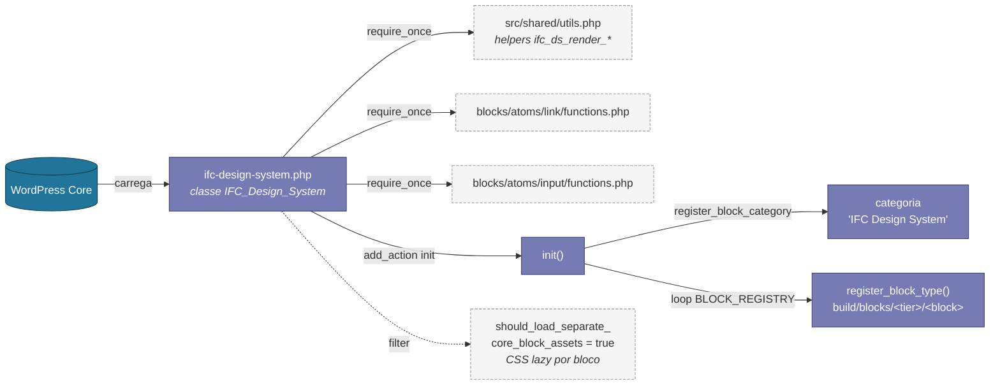
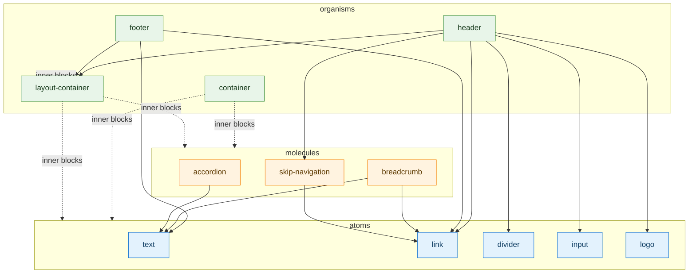
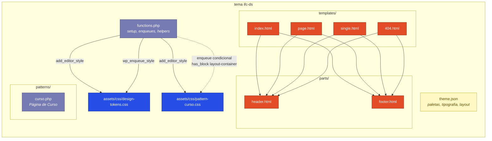
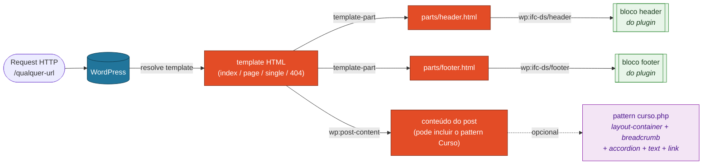
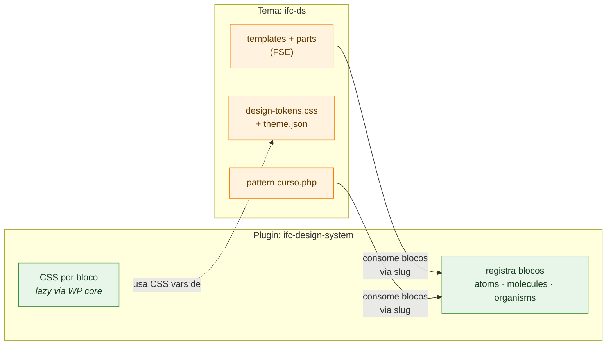

# Diagramas de Arquitetura

Este documento apresenta uma visão **macro** da arquitetura do projeto. Para
manter a leitura limpa, foram desconsiderados de propósito:

- Pipeline de build (`@wordpress/scripts`, `node_modules`, `package.json`).
- Scripts utilitários (`scripts/` do plugin).
- Estilos compartilhados de baixo nível (`mixins`, `class-builder`, `style.scss`).
- Tabelas de tokens / paletas individuais — referenciamos apenas o
  arquivo `theme.json` e o `design-tokens.css` como blocos opacos.

O foco é mostrar **quem depende de quem** e **como o conteúdo é produzido no
WordPress** (registro de blocos, hierarquia FSE e composição dos blocos).

---

## 1. Plugin `ifc-design-system`

O plugin é a única fonte de **blocos Gutenberg** do projeto. Sua arquitetura
interna segue o **Atomic Design** (atoms → molecules → organisms) e o
registro acontece de forma declarativa via `BLOCK_REGISTRY`.

### 1.1. Bootstrap e registro

### 1.2. Hierarquia de blocos (Atomic Design)

Mostra apenas as **dependências de composição** declaradas nos `render.php` de
cada bloco. Setas saem do bloco que **consome** para o bloco/helper que é
**consumido**.

**Leitura rápida:**

- **Atoms** não dependem de outros blocos — são primitivos.
- **Molecules** compõem apenas atoms.
- **Organisms** podem compor molecules e atoms; `container` e
  `layout-container` aceitam *inner blocks* arbitrários (composição livre via
  Gutenberg).

---

## 2. Tema `ifc-ds` (FSE / Block Theme)

O tema é uma **camada fina**. Ele não declara blocos — apenas:

1. Declara suportes do WordPress (FSE, title-tag, post-thumbnails…).
2. Enfileira fontes, design tokens e o script da Barra do Governo.
3. Expõe templates HTML (Site Editor) e o pattern *Página de Curso*.

### 2.1. Composição do tema

### 2.2. Fluxo de uma requisição (FSE)

Como o WordPress monta uma página combinando *templates → parts → blocos do
plugin*.

---

## 3. Integração tema ↔ plugin

Resumo das responsabilidades. Os dois pacotes são **fracamente acoplados** — o
tema só conhece o plugin pelos *slugs* dos blocos (`ifc-ds/header`,
`ifc-ds/footer`, `ifc-ds/layout-container`, …).

**Pontos de contato:**

| Quem                | Depende de               | Como                                       |
|---------------------|--------------------------|--------------------------------------------|
| `parts/header.html` | `ifc-ds/header`          | `<!-- wp:ifc-ds/header /-->`               |
| `parts/footer.html` | `ifc-ds/footer`          | `<!-- wp:ifc-ds/footer /-->`               |
| `patterns/curso.php`| `ifc-ds/layout-container`, `breadcrumb`, `accordion`, `link`, `text`, `container` | Markup de bloco serializado |
| CSS dos blocos      | `design-tokens.css`      | Variáveis CSS (`--ifc-spacing-*`, `--ifc-color-*`) |

---

## 4. Acessibilidade — eMAG / WCAG / WAI-ARIA

A camada de acessibilidade é **transversal** ao DS. As decisões abaixo
servem como referência rápida; o relatório completo está em
`docs/acessibilidade-emag.md`.

```mermaid
flowchart TB
    subgraph Body["<body> (FSE)"]
        direction TB
        SkipGlobal["<a class='ifc-ds-skip-link' accesskey='1'><br/>Ir para o conteúdo</a><br/><i>injetado via wp_body_open</i>"]
        BarraBrasil["<nav aria-label='Barra Brasil'>"]
        Header["<header role='banner'><br/>ifc-ds/header"]
        Main["<main id='main' tabindex='-1'>"]
        Footer["<footer role='contentinfo' id='footer'><br/>ifc-ds/footer"]
    end

    subgraph HeaderInner["dentro do bloco header"]
        direction TB
        SkipNav["<nav aria-label='Atalhos de acessibilidade'><br/>accesskey 1·2·3·4"]
        Search["<form role='search'>"]
        SocialNav["<nav aria-label='Redes sociais'><br/>aria-label='X (abre em nova janela)'"]
        InstNav["<nav aria-label='Menu institucional' id='nav'>"]
    end

    SkipGlobal --> Main
    SkipNav -- "#main" --> Main
    SkipNav -- "#nav" --> InstNav
    SkipNav -- "#busca" --> Search
    SkipNav -- "#footer" --> Footer

    Header --> HeaderInner

    classDef ax fill:#fff8c5,color:#5b4a00,stroke:#bfa700
    classDef nav fill:#e3f2fd,color:#0d3c61,stroke:#1976d2
    classDef main fill:#e8f5e9,color:#1b3d1f,stroke:#388e3c

    class SkipGlobal,SkipNav ax
    class BarraBrasil,SocialNav,InstNav,Header,Footer nav
    class Main,Search main
```

| eMAG / WCAG | Onde está implementado | Resumo |
|---|---|---|
| 1.5 / 4.1 (skip-link como 1º foco) | `themes/ifc-ds/functions.php` (`wp_body_open`) | `<a class="ifc-ds-skip-link" accesskey="1">` |
| 4.1 (atalhos 1·2·3·4) | `src/shared/utils.php` + `molecules/skip-navigation` | Conteúdo, Menu, Busca, Rodapé |
| 1.2 / 1.3 (semântica) | `atoms/text` + `molecules/accordion` + `organisms/footer` | `<h2>` por seção; `headingLevel` configurável |
| 1.8 (landmarks) | `organisms/header` (banner) e `footer` (contentinfo) | Templates expõem `<main id="main" tabindex="-1">` |
| 1.9 / 3.2.5 (nova aba) | `atoms/link` + `atoms/logo` | `aria-label` recebe sufixo "(abre em nova janela)" |
| 2.1 (teclado) | `molecules/accordion/frontend.js` | Enter, Space, Setas, Home, End |
| 3.4 (localização) | `molecules/breadcrumb` | `<nav aria-label="Navegação estrutural">` |
| 3.5 (descrição de link) | `atoms/link` (drop `title`) | `aria-label` para ícones; texto descritivo |
| 4.4 (foco visível) | `mixins-essentials.scss` | `@mixin ifc-focus-ring` em todos os interativos |
| 6.2 (label associado) | `atoms/input` | `<label for>` obrigatório ou `aria_label` + `hideLabel` |
| 6.5 / 6.6 (validação) | `atoms/input` | `aria-required`, `aria-invalid`, `role="alert"` |
